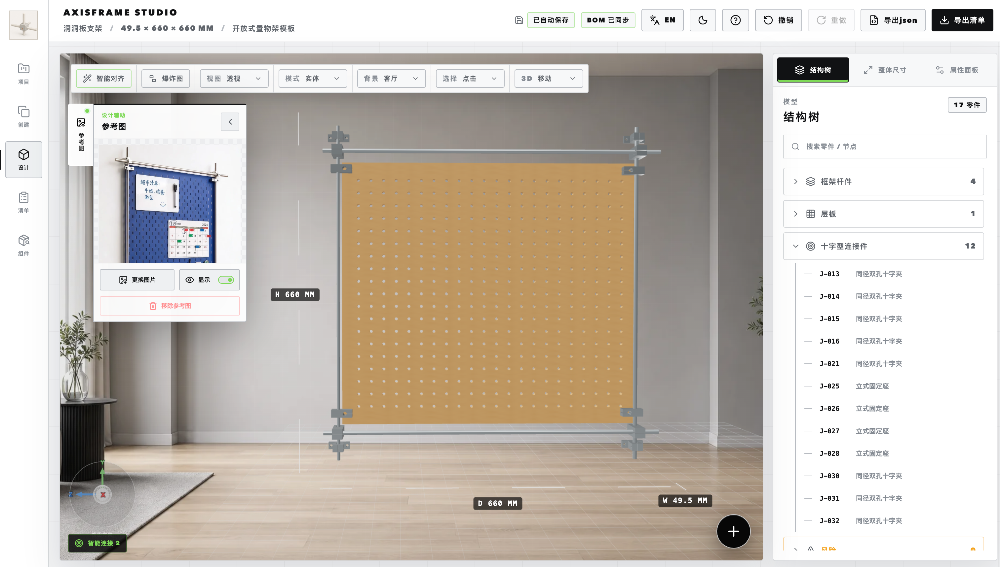

# AxisFrame

[中文](README.md) | **English**



AxisFrame is a constraint-driven 3D design tool for DIY makers and lightweight structural projects. It brings real-scale linear shafts, connectors, bearings, and panels into a single browser-based workspace, helping people without traditional CAD experience build understandable, editable structures and turn them into practical procurement and assembly plans.

## Key Features

- Design 3D structures made from linear shafts, connectors, bearings, and panels directly in the browser.
- Start quickly with a built-in component library and structural templates.
- Adjust dimensions, materials, hole positions, orientations, and stock variants with parametric controls.
- Assemble parts with smart guides, connection ports, surface-contact constraints, and overall dimension controls.
- Edit efficiently with undo and redo, copy, mirror, grouping, exploded views, reference images, and multiple camera views.
- Check connection validity, structural support, and gravity-related risks while keeping the bill of materials in sync.
- Export order workbooks and project JSON backups.
- Save projects, reusable templates, and auto-save snapshots locally in the browser.
- Use the interface in Chinese or English, with light and dark themes and responsive layouts.

## Technology

AxisFrame is built with React 19, TypeScript, Three.js, React Three Fiber, Vite 7, and ExcelJS. It is a client-side web application and does not require a separate backend or database.

## Requirements

- Node.js `^20.19.0 || >=22.12.0`
- npm
- A modern desktop browser with WebGL support

## Installation

Clone the repository and install the locked dependencies:

```bash
git clone https://github.com/HansonChan/AxisFrame.git
cd AxisFrame
npm ci
```

Start the local development server:

```bash
npm run dev
```

Open [http://127.0.0.1:5173](http://127.0.0.1:5173) in your browser.

## Production Build

```bash
npm run build
npm run preview
```

The production bundle is generated in `dist/`. To deploy AxisFrame to a static hosting service, publish the contents of that directory.

## Project Structure

```text
AxisFrame/
├── src/             # Pages, 3D scenes, editor behavior, and domain logic
├── public/assets/   # Runtime models, images, and preview assets
├── index.html       # Web entry point
├── package.json     # Dependencies and runtime commands
└── vite.config.ts   # Vite development server configuration
```

## Local Data

AxisFrame currently stores projects in the browser's local storage. Export a project JSON backup before clearing site data or moving to another browser. Imported reference images are also saved as part of the local project snapshot.

## License

AxisFrame is licensed under the [MIT License](LICENSE).
